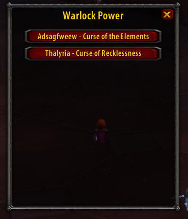

# Warlock power

Concept/addon broad casting code stolen directly from pally power

Use /wp to open warlock power. Click to cycle through curses to assign to each warlock



Exposes your currently assigned curse as `WP_Curse`

Intended to be used via either cursive, or a CastSpellByName macro

## Example macros

Cursive
```
/script if not Cursive:Curse(WP_Curse, "target", {refreshtime=0}) then end
```

No Cursive
```
/script CastSpellByName(WP_Curse);
```
